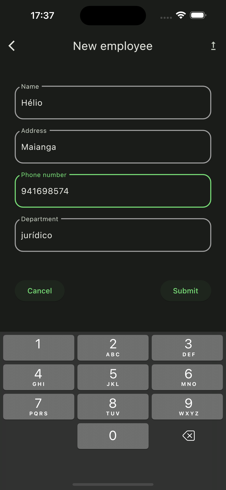
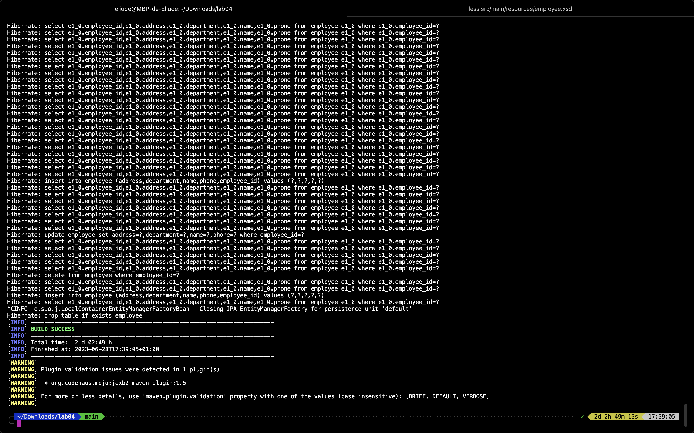

<!-- Improved compatibility of back to top link: See: https://github.com/othneildrew/Best-README-Template/pull/73 -->
<a name="readme-top"></a>
<!--
*** Thanks for checking out the Best-README-Template. If you have a suggestion
*** that would make this better, please fork the repo and create a pull request
*** or simply open an issue with the tag "enhancement".
*** Don't forget to give the project a star!
*** Thanks again! Now go create something AMAZING! :D
-->


<!-- PROJECT SHIELDS -->
<!--
*** I'm using markdown "reference style" links for readability.
*** Reference links are enclosed in brackets [ ] instead of parentheses ( ).
*** See the bottom of this document for the declaration of the reference variables
*** for contributors-url, forks-url, etc. This is an optional, concise syntax you may use.
*** https://www.markdownguide.org/basic-syntax/#reference-style-links
-->
[![Contributors][contributors-shield]][contributors-url]
[![Forks][forks-shield]][forks-url]
[![Stargazers][stars-shield]][stars-url]
[![Issues][issues-shield]][issues-url]


<!-- PROJECT LOGO -->
<br />
<div align="center">
  <h3 align="center">Employee CRUD</h3>

  <p align="center">
    CRUD with flutter and spring boot (soap api)
    <br />
    <a href="https://github.com/HelioPC/SoapCrud"><strong>Explore the docs »</strong></a>
    <br />
    <br />
    <a href="https://github.com/HelioPC/SoapCrud">View Demo</a>
    ·
    <a href="https://github.com/HelioPC/SoapCrud/issues">Report Bug</a>
    ·
    <a href="https://github.com/HelioPC/SoapCrud/issues">Request Feature</a>
  </p>
</div>


<!-- TABLE OF CONTENTS -->
<details>
  <summary>Table of Contents</summary>
  <ol>
    <li>
      <a href="#about-the-project">About The Project</a>
      <ul>
        <li><a href="#built-with">Built With</a></li>
      </ul>
    </li>
    <li>
      <a href="#getting-started">Getting Started</a>
      <ul>
        <li><a href="#prerequisites">Prerequisites</a></li>
        <li><a href="#installation">Installation</a></li>
      </ul>
    </li>
    <li><a href="#usage">Usage</a></li>
    <li><a href="#roadmap">Roadmap</a></li>
    <li><a href="#contributing">Contributing</a></li>
    <li><a href="#contact">Contact</a></li>
    <li><a href="#acknowledgments">Acknowledgments</a></li>
  </ol>
</details>


<!-- ABOUT THE PROJECT -->
## About The Project


This is my laboratory experience for the subjects of mobile application development and distributed systems in the computer science course.

It consists of creating a SOAP API for the server side and a user interface for the client side that consumes the API.

<p align="right">(<a href="#readme-top">back to top</a>)</p>


### Built With

On the server side, in this case the SOAP API, I used the SPRING BOOT java framework. For the client side, in this case, the mobile application I created with the flutter SDK that uses the dart programming language.

* [![Flutter][Flutter.dart]][Flutter-url]
* [![Dart][Dart.dart]][Dart-url]
* [![Spring][Spring.java]][Spring-url]
* [![Java][Java.java]][Java-url]

<p align="right">(<a href="#readme-top">back to top</a>)</p>


<!-- GETTING STARTED -->
## Getting Started

To start with, you should have a reasonably powerful machine, say 8GB of RAM.
You must be connected to the internet and have git configured on your machine to be able to clone the repository.
The flutter SDK must be installed and configured, as well as android studio with at least one emulator, to run the mobile application.
To get a local copy up and running follow these simple example steps.

### Prerequisites

* flutter
  ```sh
  flutter upgrade
  ```
  ```sh
  flutter doctor -v
  ```

* java
  ```sh
  javac --help
  ```

### Installation

1. Clone the repo
   ```sh
   git clone https://github.com/HelioPC/SoapCrud.git
   ```
2. Install flutter packages
   ```sh
   flutter pub get
   ```
3. Edit the `src/main/resources/application.properties` file and add your mysql credentials
   ```sh
   nano src/main/resources/application.properties
   ```
4. Start mysql client
   ```sh
   mysql --host=INSTANCE_IP --user=root [--password=password]
   ```
5. Start the API
   ```sh
   ./mvnw spring-boot:run
   ```
6. Start an emulator and make sure it's running
   ```sh
   flutter devices
   ```
7. Run the flutter application
   ```sh
   flutter run [-d EMULATOR_ID]
   ```

<p align="right">(<a href="#readme-top">back to top</a>)</p>


<!-- USAGE EXAMPLES -->
## Usage






_For more examples, please refer to the [Documentation](#acknowledgments)_

<p align="right">(<a href="#readme-top">back to top</a>)</p>


<!-- ROADMAP -->
## Roadmap

- [x] Add API CRUD with SOAP
- [x] Add static UI
- [x] Add UI with data from API
- [x] Add README
- [ ] Multi-language Support
    - [ ] English
    - [ ] Portuguese

See the [open issues](https://github.com/HelioPC/SoapCrud/issues) for a full list of proposed features (and known issues).

<p align="right">(<a href="#readme-top">back to top</a>)</p>


<!-- CONTRIBUTING -->
## Contributing

If you have a suggestion that would make this better, please fork the repo and create a pull request. You can also simply open an issue with the tag "enhancement".
Don't forget to give the project a star! Thanks again!

1. Fork the Project
2. Create your Feature Branch (`git checkout -b feature/AmazingFeature`)
3. Commit your Changes (`git commit -m 'Add some AmazingFeature'`)
4. Push to the Branch (`git push origin feature/AmazingFeature`)
5. Open a Pull Request

<p align="right">(<a href="#readme-top">back to top</a>)</p>


<!-- CONTACT -->
## Contact

My Name - [eliude_c](https://discord.com/) - My discord

Project Link: [https://github.com/HelioPC/SoapCrud](https://github.com/HelioPC/SoapCrud)

<p align="right">(<a href="#readme-top">back to top</a>)</p>


<!-- ACKNOWLEDGMENTS -->
## Acknowledgments

* [Fultter docs](https://docs.flutter.dev)
* [Spring guides](https://spring.io/guides)

<p align="right">(<a href="#readme-top">back to top</a>)</p>

<!-- MARKDOWN LINKS & IMAGES -->
<!-- https://www.markdownguide.org/basic-syntax/#reference-style-links -->
[contributors-shield]: https://img.shields.io/github/contributors/HelioPC/SoapCrud.svg?style=for-the-badge
[contributors-url]: https://github.com/HelioPC/SoapCrud/graphs/contributors
[forks-shield]: https://img.shields.io/github/forks/HelioPC/SoapCrud.svg?style=for-the-badge
[forks-url]: https://github.com/HelioPC/SoapCrud/network/members
[stars-shield]: https://img.shields.io/github/stars/HelioPC/SoapCrud.svg?style=for-the-badge
[stars-url]: https://github.com/HelioPC/SoapCrud/stargazers
[issues-shield]: https://img.shields.io/github/issues/HelioPC/SoapCrud.svg?style=for-the-badge
[issues-url]: https://github.com/HelioPC/SoapCrud/issues
[product-screenshot]: screenshot/home.png
[Flutter.dart]: https://img.shields.io/badge/Flutter-02569B?style=for-the-badge&logo=flutter&logoColor=white
[Flutter-url]: https://flutter.dev/
[Spring.java]: https://img.shields.io/badge/SPRINGBOOT-6DB33F?style=for-the-badge&logo=spring&logoColor=white
[Spring-url]: https://spring.io
[Dart.dart]: https://img.shields.io/badge/Dart-0175C2?style=for-the-badge&logo=dart&logoColor=white
[Dart-url]: https://dart.dev
[Java.java]: https://img.shields.io/badge/Java-ED8B00?style=for-the-badge&logo=openjdk&logoColor=white
[Java-url]: https://www.java.com/en/